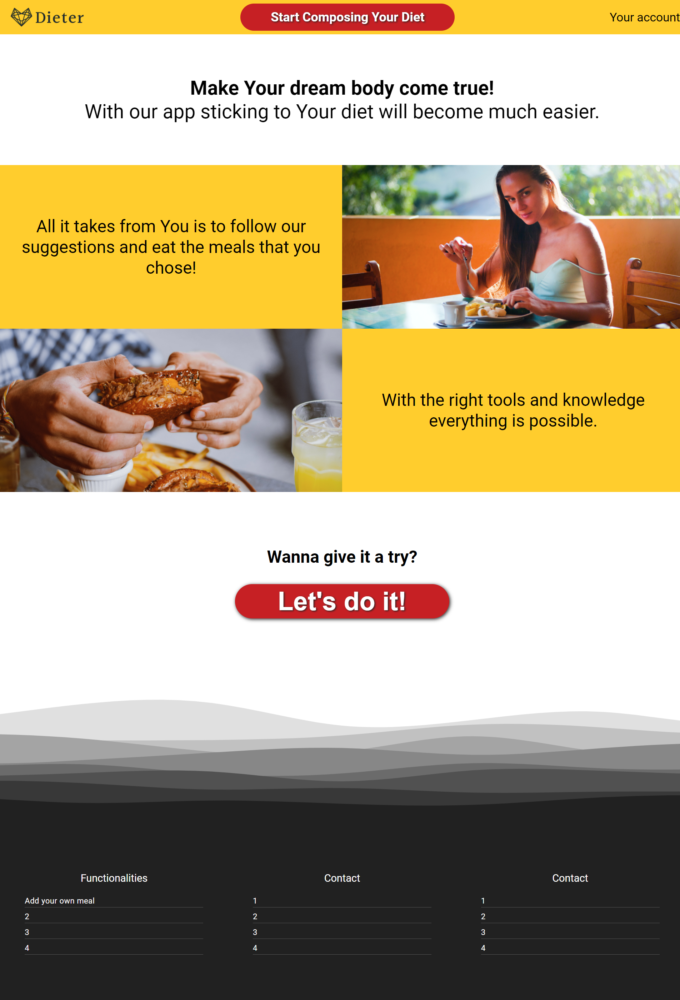
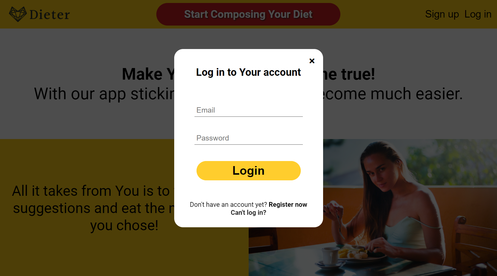
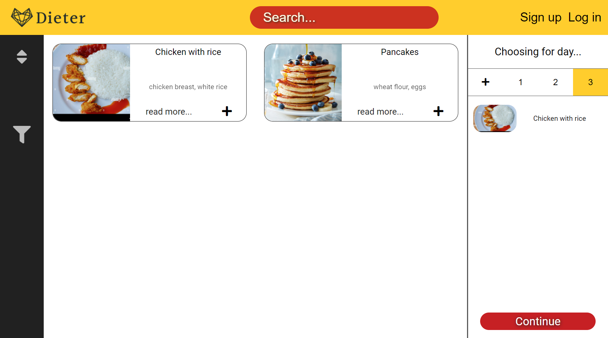
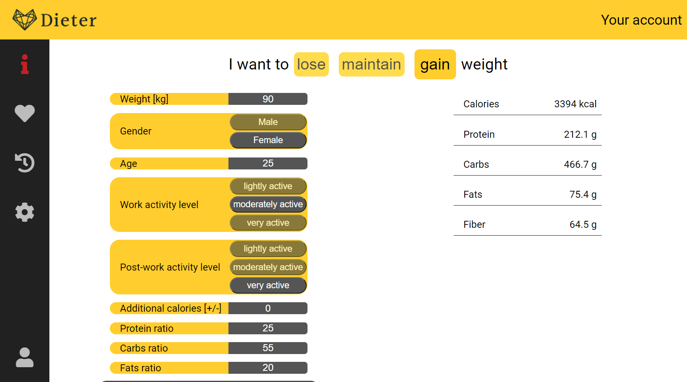
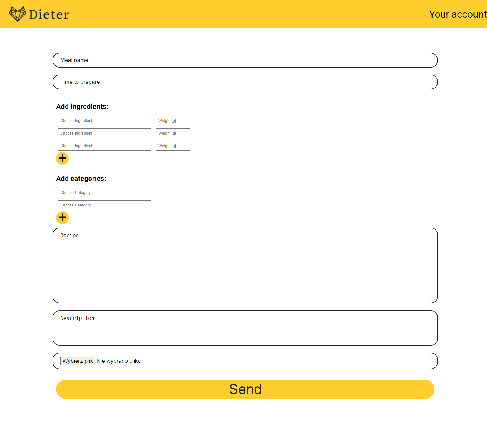
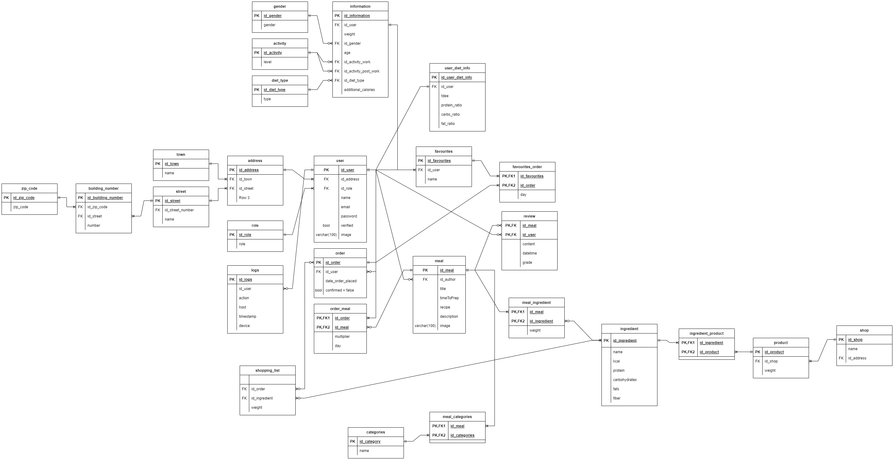

# DietEasier

# TechStack
- HTML
- CSS
- JS
- PHP
- PostgreSQL
- Docker
- Heroku

## Description
Dieter is an application that creates personalised diets for users based on their preferences.
User needs only to create an account and provide us with some information.
Then we will be able to calculate his energetic needs. 
After that the user will be able to choose meals that he wants to base his diet on.
At the end, the user will be left with a complete diet including recipes and a shopping list.

## Views
### Home

### Login

### Choose Meals

### Information

### Add Meal

## Diagram ERD

# Code
## Frontend
Almost 1000 lines of code in 8 JS files, providing many ajax functionalities. Views done in plain HTML and CSS.

## Backend
Consists of over 12 **PHP** files and more than 1000 lines of code. 