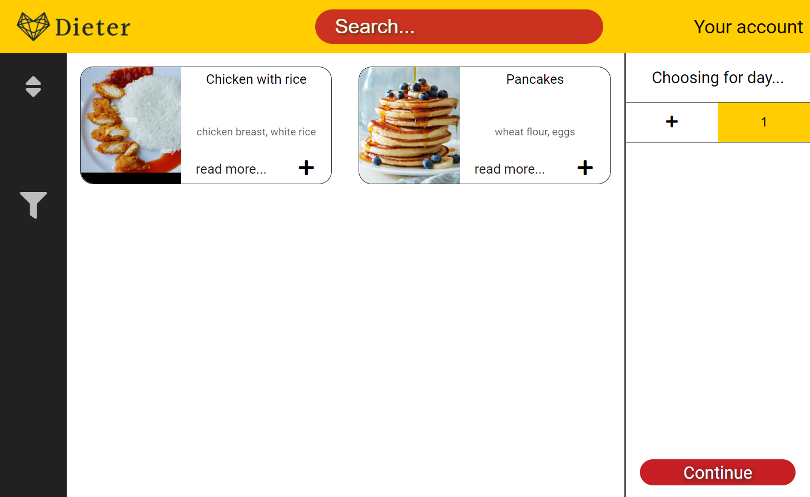

# DietEasier

## Description
Dieter is an application that creates personalised diets for users based on his preferences.
User only needs to create an account and enter information about him.
Then our algorithm will calculate his energetic needs. 
Then the user needs to choose meals that he wants to include in his diet.
In the end, user will obtain a diet covering his needs, containing his meals with recipes and a shopping list.

## Information form
### At the following page user will enter his information

# Choosing meals
### At the following page user will choose preferred meals

## Diagram ERD

## //TODO
- ~~Transfer DB ERD to the DB~~
- ~~Watch the 10th video~~
- ~~Figure out how **not to** duplicate code in html pages~~
- ~~Watch the 11th video~~
- ~~Watch the 12th video~~
- ~~Watch the 13th video~~
- ~~Modify addMeal page with adding ingredients and categories~~
- ~~Login and registration systems working~~
- ~~Check register's data~~
- ~~Figure out how to check if user's is logged in~~
- ~~Figure out how to change **Navbar** properties after user has logged in~~
- ~~meal: display ingredients with weight~~
- ~~meal: display calculated macroelements~~
- ~~Make chooseMeals display meals with their ingredients~~
- ~~Make chooseMeals redirect to a particular Meal page~~
- ~~ChooseMeals: mealAssigner working~~
- ~~ChooseMeals: search fetching and inserting all of the data~~
- ~~Register: Redo email check, if correct~~
- ~~Register: check if email is taken~~
- ~~Register: add more if's with messages~~
- ~~Register: encrypt password~~
- ~~Register&Login: Make it work on all of the pages~~
- ~~Meal: Fix problem of loading JS files~~
- ~~ChooseMeals: implement choosing meals through categories~~
- ~~Information: Collect and display users information~~
- ~~Information: Calculate users nourishment needs~~
- ~~Information: finish updating data~~
- ~~addMeal: read ingredients with weights~~
- ~~addMeal: Check if adding meals correctly~~
- ~~addMeal: Add authors ID~~
- ~~ChooseMeals: Fetch last unConfirmed order~~
- ~~ChooseMeals: On page leave update order~~
- ~~ChooseMeals: implement mobile version~~
- ~~ChooseMeals: implement deletion of meals~~ 
- ~~WhatYouChose: change to grid~~
- ~~ERD: update diagram~~
- ~~fix your code~~
- WhatYouChose: Calculate weight ratios to fit energy needs
- WhatYouChose: Add to order history
- WhatYouChose: Calculate meals` multiplier
- WhatYouChose: Allow users to modify multipliers
- WhatYouChose: Change values after modifying multipliers
- ShoppingList: display calculated shopping list
- ShoppingList: allow user to modify it
- Your account: Display users data
- Your account: Add logout button
- Order History: Display users order history
- Favourites: Display users favourites
- addMeal: Check if inputs correct
- Meal: Reviews System Working
- ChooseMeals: add spinning wheel to meal assigner
- ChooseMeals: optimize or cut the number of fetches
- ChooseMeals: implement mobile version of meal-assigner and categories
- ALL: implement mobile version of navbar scroll-downs

## Development Stages
### Stage 1 [Building a working app with mentioned below features]
- Calculating users **actual energy needs**
- Calculating users recommended **protein**, **carbohydrates**, **fats** and **fiber** intake
- Allowing the user to **modify** calculated values
- Allowing the user to **choose the meals** for his diet
- Modifying the meals **weight** and **ratios** of **ingredients** in order to fit his dietary needs
- Allowing the user to **save his orders in favourites** section
- Keeping **order history**
- Using chosen meals to prepare **shopping list**
- Preparing pdf-files for users orders containing **recipes** of chosen meals, with the right day and meal order
- Users should have the option to **add Meals** to database, after checking their quality

### Stage 2 [Re-designing the website for the best User Experience and filling with content]
- Home page should have a great, **self-explanatory hero**
- Home page should **explain**, in detail, **how does the app work**, with screenshots and animations
- Applications Database should be filled with **different meals**
- Every page should have a very **clear hierarchy**
- Choosing the right brand colors
- Choosing brands name

### Stage 3 [Releasing the website]
- Choosing adequate **hosting** option
- Calculating maintenance **costs**
- Fixing **loopholes** in the system

### Stage 4 [Partnering with groceries delivery company like Glovo.com or Lisek.app]
- Preparing websites **presentation**
- Preparing websites **traffic** charts
- Preparing **business propositions**